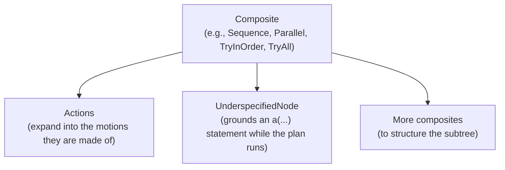

(plan_header)=

# The CoraPlex Plan

```{contents}
:local:
:depth: 1
```

## What is a Plan?

A plan is what a robot does: the nodes at the top level of a cramph statechart. A statechart is a tree of nodes, and
every node has two states. Its life cycle state says where it is in its run: not started, running, paused, or ended as
succeeded, failed or interrupted. Its observation says what it sees right now: true, false or unknown. A node moves
through its life cycle when its transition conditions hold, and those conditions are expressions over the states of
other nodes: a step of a sequence starts once the step before it succeeded, a parallel succeeds once all of its
children did, and a monitor pauses or cancels the subtree it watches.

The statechart is compiled once, before it runs, and then ticked: every tick reads what each running node observes
and settles every life cycle state, pass by pass, until nothing changes any more, so a whole chain of consequences
takes effect within a single tick. That is the same loop Giskard runs motions in, so a plan and the motions it is made
of live in one statechart.

A plan's nodes are usually cramph composites, such as `Sequence`, `Parallel`, `TryInOrder` or `TryAll`, holding
actions, motions and further composites. They are built on their own, before they join a statechart:

```python
from cramph.composites import Sequence

plan = Sequence([ParkArmsAction(robot.all_arms), NavigateAction(target_pose)])
```

## How a Plan is shaped

Each top-level node of a plan is a tree with a composite at the top and actions beneath it:



- Composites define the order and concurrency of their children, and how a failing child affects them.
- Actions expand into the motions they are made of once they join a statechart.
- An `UnderspecifiedNode` holds an `a(...)` statement, which is grounded into a concrete action against the world as
  the steps before it left it, each candidate being tried on a copy of the world first.

## Why the statechart matters to CoraPlex

- **One structure for describing and running behaviour.** The plan a developer writes is the statechart that runs, so
  nothing is translated between a plan and its execution, and what ran is what was written.
- **Plans react while they run.** Monitors pause, resume or cancel parts of a plan as the world changes, and a failing
  attempt lets a `TryInOrder` move on to the next alternative, without the plan polling for any of it.
- **Plans and motions share one control loop.** Actions expand into giskard goals in the same statechart, so the
  controller sees every motion the plan currently runs and the plan sees every motion's progress.
- **A plan can grow while it runs.** An `UnderspecifiedNode` grounds its statement only once it is reached, against
  the world as the steps before it left it, and the chosen action joins the running statechart.
- **The statechart is the record of what happened.** Every node keeps its life cycle and observation history, which is
  what visualizations, recordings and the ORM read.
- **It can be sent to the robot.** A statechart serializes to JSON, so the same plan runs in simulation or is sent to
  Giskard on the real robot.

## Executing a Plan

An executor builds the statechart context a plan runs in, out of the world and the context extensions it is given,
and compiles and executes the statechart holding the plan, the way a Giskard executor compiles and executes a motion
statechart:

```python
from coraplex.plans.context_extensions import RobotAccess
from coraplex.plans.executors import SimulatedPlanExecutor
from cramph.statechart import Statechart

executor = SimulatedPlanExecutor(world, context_extensions=[RobotAccess(robot)])
statechart = Statechart(context=executor.context)
statechart.add_node(plan)
executor.compile(statechart)
executor.execute()
```

- The context extensions carry what every node of the plan reads from its context, such as the robot performing it
  (`RobotAccess`) and how its statements are grounded (`StatementGrounding`).
- `compile` adds to the statechart the collision avoidance when the executor is asked for it, and an `EndMotion` that
  ends the statechart once every top-level node of the plan succeeded.
- `execute` runs that statechart: a `SimulatedPlanExecutor` in simulation, a `RobotPlanExecutor` by sending it to
  Giskard on the real robot. It raises `MotionDidNotFinish` if the plan did not succeed.
- An executor runs one statechart, so every plan gets an executor of its own.

## Inspecting a Plan

Every node of an executed plan keeps its life cycle state, start and end, so the plan itself is the record of what
the robot did. Its statechart can be drawn with `plan.statechart.visualize()`, and an executed plan can be stored in
a database through ORMatic like any other node.
